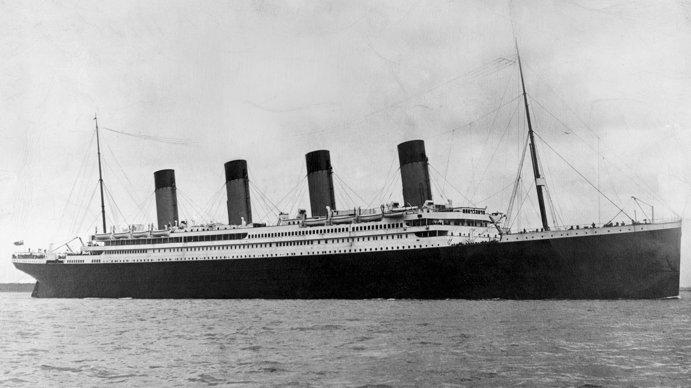
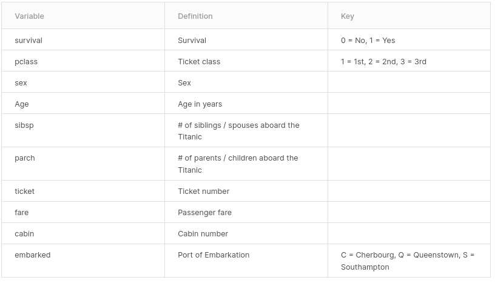

# Titanic survival project

RMS Titanic was a British passenger liner, operated by the White Star Line, which sank in the North Atlantic Ocean on 15 April 1912 after striking an iceberg during her maiden voyage from Southampton, UK, to New York City. Unfortunately, there weren’t enough lifeboats for everyone onboard, resulting in the death of 1502 out of 2224 passengers and crew which made the sinking possibly one of the deadliest for a single ship up to that time. It remains to this day the deadliest peacetime sinking of a superliner or cruise ship.

While there was some element of luck involved in surviving, it seems some groups of people were more likely to survive than others. This project aims to develop a machine learning classifiers to predict which passengers survived the Titanic shipwreck given features like age, gender, socio-economic class, etc.

## About the data

The data was downloaded from <a href="https://www.kaggle.com/c/titanic">Kaggle</a> and only the trainning set is in use for this project. The trainning set containg the target variable and can be used to evaluate our model. The test set, without the target, is used for predictions when participating in the Kaggle competition.

**Variable Notes**

- `pclass`: A proxy for socio-economic status (SES)  
 1st: Upper  
 2nd: Middle 
 3rd: Lower 

- `age`: Age is fractional if less than 1. If the age is estimated, is it in the form of xx.5

- `sibsp`: The dataset defines family relations in this way: 
Sibling: brother, sister, stepbrother, stepsister 
Spouse: husband, wife (mistresses and fiancés were ignored) 

- `parch`: The dataset defines family relations in this way: 
Parent: mother, father 
Child: daughter, son, stepdaughter, stepson 
Some children travelled only with a nanny, therefore parch=0 for them. 
